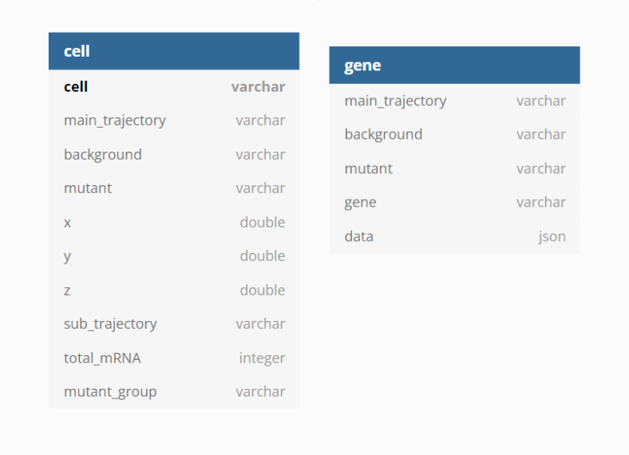
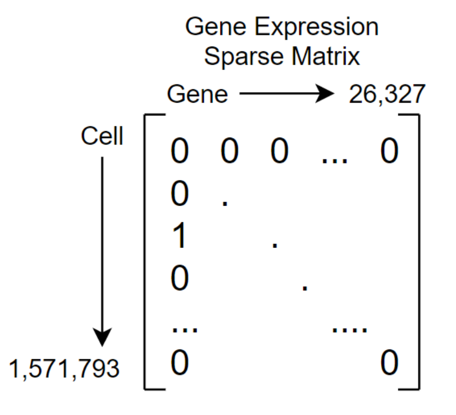

# Mouse Mutant Cell Atlas 3D Data Visualization

This app visualized the cell x gene data from mutant and wild-type mice. Each cell's main and sub-developmental trajectories were determined using the [UMAP algorithm](https://umap-learn.readthedocs.io/en/latest/how_umap_works.html). The algorithm outputs x, y, and z values for each cell. When plotted, it provides insight into the clustering of cells in their trajectories.

### Table of contents

- [Build](#build)
- [Data Model](#data-model)
	- [Challenges](#challenges)
- [API](#api)
- [Install](#install)
- [TODO](#todo)

### Overview

The user can select which main trajectory to plot, filter by the strain of mouse (background) and mutation, then color the points by sub trajectory, total mRNA, mutant group, or expression of a certain gene.

[Live Version](https://atlas.gs.washington.edu/mmca_v2/)

> ~3 second initial load

There are 2 plots to allow for a side-by-side comparison of different annotations or filter combinations. The camera's zoom, rotation, and pan are synced up between the plots for easier comparison.

## Build

The application uses the following tech stack:
- Sqlite3 (compiled with json1 extension)
- Express.js / Node.js
- Javascript
- Plotly.js
- [Skeleton css biolerplate](http://getskeleton.com/)

## Data Model

The data model is comprised of two tables `cell` and `gene`. The `cell` table contains the UMAP coordinates as well as metadata for each cell. These attributes are used to filter or annotate (color) the 3d scatter plots. There is a compound index on columns (`main_trajectory`, `background`, `mutant`) because all plots will use some combination of these attributes to filter.

The `gene` table is indexed similarly with the addition of the `gene` attribute (`main_trajectory`, `background`, `mutant`, `gene`). The final column (`data`) is a json array with keys being the cell_id and values corresponding to that cell's gene expression.

	data = [ {"cell id 1": expression}, {"cell id 2": expression}, ... ]

	[
		{"MM-expr04-plate01-006.ACGCTTGATCCATTATCTA": 1},
		{"MM-expr04-plate01-073.TAGAGAGTATTAACTGGTTA": 2},
		{"MM-expr04-plate02-031.TAAGGTTCATCGTAGTTACC": 1}
	]

This model allows for a quick response to the front end given the application's multiple filters and large data scale.

### Challenges

The gene data was particularly challenging to construct a fast query around. This was primarily due to the number of cells and genes that were tested. The gene expression data was provided to me in a [sparse matrix](https://en.wikipedia.org/wiki/Sparse_matrix) format:

There are in total 41,380,594,311 entries in the matrix with 1,068,417,870 non-zero entries. My first idea was to use 3 columns to represent the matrix: column index, row index, value, or in this case `cell_id`, `gene`, `expression`. I set up a one-to-many relationship with the `cell` table on `cell_id` and added an index on (`cell_id`, `gene`) This resulted in a table with ~1 billion rows and very slow queries. Rethinking the data model and remembering json worked with relational databases lead me to the current data model which performs much faster.

## API

Express.js serves both the front end and back end for this application. There is one route to interact with the database. The database connection is read-only.

#### /mmca_v2/data

query parameter keys and value options:

- backgorund
	- G4
	- FVB
	- C57BL6
- trajectory
	- Haematopoiesis trajectory
	- Cardiomyocyte trajectory
	- Endothelial trajectory
	- Mesenchymal trajectory
	- Neural tube and notochord trajectory
	- Epithelial trajectory
	- Neural crest (PNS neuron) trajectory
	- Hepatocyte trajectory
	- Melanocyte trajectory
	- Neural crest (PNS glia) trajectory
	- Myoblast trajectory
	- Myotube trajectory
	- Olfactory sensory
- mutant
	- Depends on the trajectory and background combination. Check the live version's selector for values

The next two are mutually exclusive
- gene
	- See /public/js/genes.js

OR

- annotation
	- sub_trajectory
	- total_mRNA
	- mutant_rt

## Install

#### Download dependencies

	npm i

> You need to build the sqlite3 npm package from source. This will enable the JSON1 and Math functions. If you are getting errors with SQLITE try to reinstall the sqlite3 npm package
 
	npm remove sqlite3

	npm i https://github.com/mapbox/node-sqlite3/tarball/master --build-from-source

#### Configure app

1. Download a lightweight version of the database here

2. Edit `public/js/global.example.js` with the correct path to the database file

3. Save copy as `global.js`

#### Start server

	node app.js

## TODO

- Add mutant scores as an annotation
- tool tips
	- Not imediate hover
